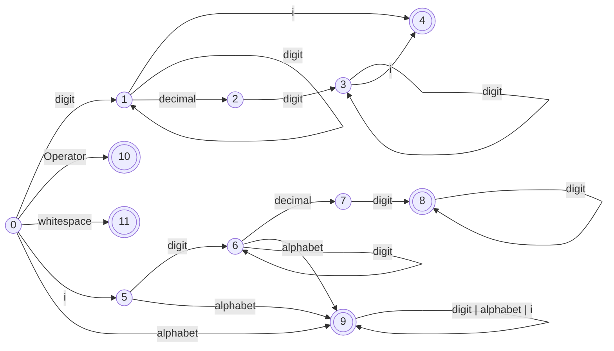

# Complex-Transforms

### A COMPILER for Transformations in Argand Plane

A compiler is made that converts complex equation to openGL program and then shows the transformation visually

### How to Use

The complex variable is z. Any transformation can be applied on z and seen visually.\
Terminate the equation using '!' \
Program has three buttons
* Press __'R'__ to restart animation
* Press __'Z'__ to zoom 
* Press __'shift + Z'__ to zoom out

### Lexer
The following represents the DFA ( Deterministic Finite Automaton ) which is used to convert incoming stream of characters into tokens representing complex number, identifier or an operator.



### Parser
The following are the production rules.
```
M -> id = X
X -> -E | E
E -> E+T | E-T
T -> T*F | T/F
F -> id | real | imaginary | (X) 
```
After removing left recursion for LL(1) parser
```
M -> id = X
X -> -E | E
E -> TE"
E" -> +TE" | -TE" | e
T -> FT"
T" -> *FT" | /FT" | e
F -> id | real | imaginary | (X)
```

### Predictive Parsing Table
Since LL(1) grammar was used, the production rules are modified to eliminate left recursion
| | id | $ | imaginary | real | + | - | * | / | ( | ) |
|---|---|---|---|---|---|---|---|---|---|---|
| M | M -> id=X | | | | | | | | | | 
| X | X -> E | | X -> E | X -> E | | X -> -E | | | X -> E | |
| E | E -> TE" | | E -> TE" | E -> TE" | | | | | E -> TE" | |
| E" | | E" -> e | | | E" -> +TE" | E" -> -TE" | | | | E" -> e | 
| T | T -> FT" | | T -> FT" | T -> FT" | | | | | T -> FT" | |
| T" | | T" -> e | | | T" -> e | T" -> e | T" -> *FT" | T" -> /FT" | | T" -> e |
| F | F -> id | | F -> imaginary | F -> real | | | | | F -> (X) | |

### Some Examples

```
z = z*z
!
```


```
z = 100/z
!
```


```
z = z*z*z/100
!
```


